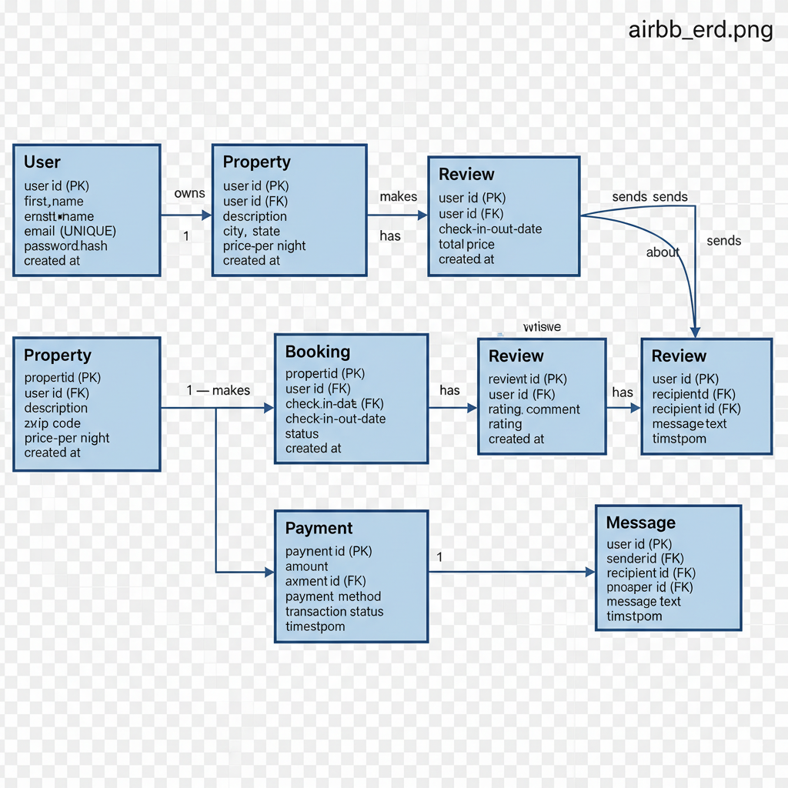

# Airbnb Database Design - ER Diagram

## 📘 Task 0: Define Entities and Relationships

### Objective
Create an Entity-Relationship (ER) diagram based on the Airbnb database specification.

---

## 🧱 Entities and Attributes

### 1. User
- user_id (PK)
- first_name
- last_name
- email (UNIQUE)
- password_hash
- phone_number
- role (guest, host, admin)
- created_at

### 2. Property
- property_id (PK)
- host_id (FK → User)
- name
- description
- location
- pricepernight
- created_at
- updated_at

### 3. Booking
- booking_id (PK)
- property_id (FK → Property)
- user_id (FK → User)
- start_date
- end_date
- total_price
- status (pending, confirmed, canceled)
- created_at

### 4. Payment
- payment_id (PK)
- booking_id (FK → Booking)
- amount
- payment_date
- payment_method (credit_card, paypal, stripe)

### 5. Review
- review_id (PK)
- property_id (FK → Property)
- user_id (FK → User)
- rating (1–5)
- comment
- created_at

### 6. Message
- message_id (PK)
- sender_id (FK → User)
- recipient_id (FK → User)
- message_body
- sent_at

---

## 🔗 Relationships
| Relationship | Type | Description |
|---------------|------|-------------|
| User → Property | 1-to-Many | One host can list multiple properties. |
| User → Booking | 1-to-Many | A guest can make multiple bookings. |
| Property → Booking | 1-to-Many | A property can be booked many times. |
| Booking → Payment | 1-to-1 | One booking corresponds to one payment. |
| Property → Review | 1-to-Many | A property can have multiple reviews. |
| User → Review | 1-to-Many | A user can write multiple reviews. |
| User → Message | 1-to-Many | Users can send multiple messages. |

---

## 📊 ER Diagram

---

## 🧠 Summary
This ER diagram represents the logical structure of the Airbnb database. It establishes relationships between users, properties, bookings, payments, reviews, and messages in a normalized, scalable design.
